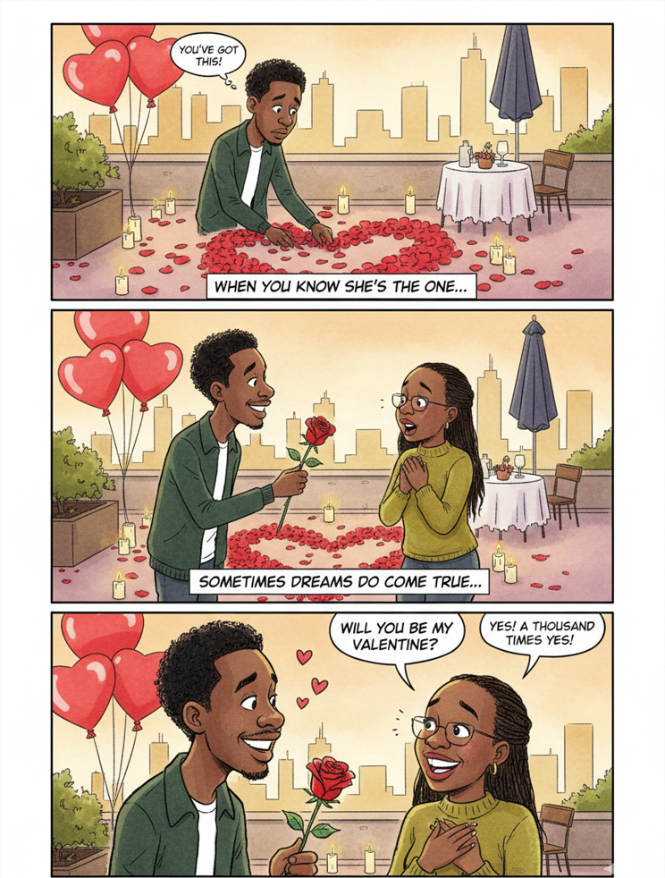
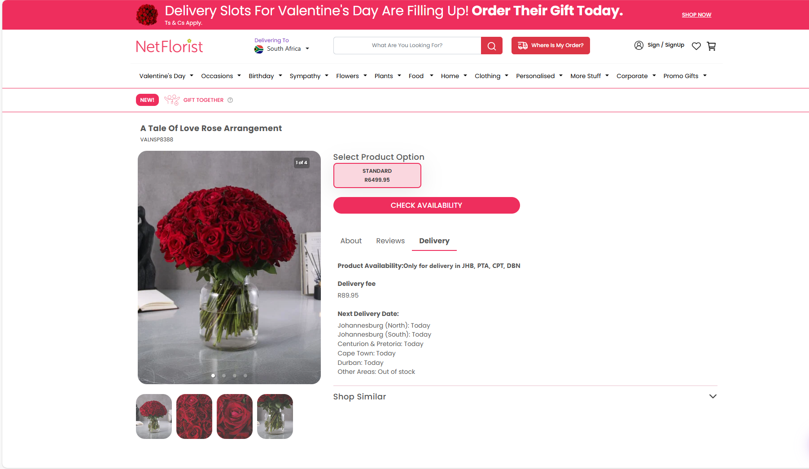
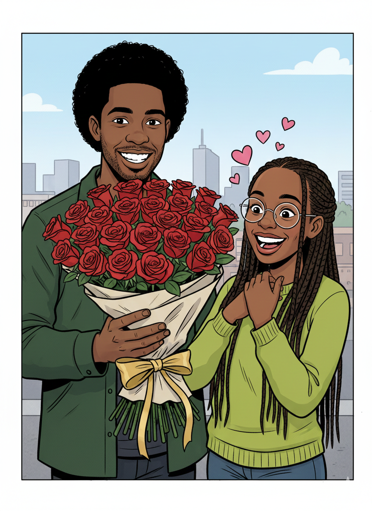

# Creating AI Art with Gemini 

---

##  [Previous](05-takeaways.md) |  [Home](../README.md) |  [Next](07-advanced-prompts.md)

---

## Same Principles, Different Canvas

Everything we learned about prompting Lovable works for AI art too.

**Be specific. Add structure. Give examples. Refine and repeat.**

---

## Our Projects: Valentine's AI Art

We created **two complementary pieces** using the same prompting principles:

1. **The 3-Panel Comic**  The full romantic story
2. **The Grand Gesture**  Just the roses moment

*Let's see both prompts in action.*

---

## Prompt #1: The 3-Panel Story

```
Generate a three-panel romantic editorial cartoon in Zapiro's style:
                                                    ↑ [3: Give Examples]

[2: Add Structure - Clear panel breakdown]
Panel 1 - 'The Preparation': Njabulo nervously preparing at 
Sandton City - arranging rose petals, setting up balloons, 
      ↑ [1: Be Specific - Exact location]
holding a rose. Thought bubble: 'You've got this!' 
                                  ↑ [1: Be Specific - Exact dialogue]
Johannesburg skyline in background.
Caption: 'When you know she's the one...'

Panel 2 - 'The Perfect Moment': Beautiful setup complete.
Njabulo presenting the rose as she approaches. 
Warm golden-hour lighting. 
  ↑ [1: Be Specific - Lighting details]
Caption: 'Sometimes dreams do come true...'

Panel 3 - 'She Says Yes!': Close-up of both - him holding 
the rose: 'Will you be my Valentine?' Her glowing: 
'Yes! A thousand times yes!' Hearts floating everywhere.
          ↑ [1: Be Specific - Exact emotional response]
Caption: 'For Siphosihle, with all my heart - Valentine's 2026'

Style: Zapiro-style editorial cartoon, bold ink lines, 
       ↑ [3: Give Examples - Specific style reference]
watercolor tones (soft pinks, warm golds, romantic reds),
                  ↑ [1: Be Specific - Exact colors]
exaggerated but tender caricature, 4:3 ratio.
                                    ↑ [1: Be Specific - Technical specs]
```

**Result:**



---

## Prompt #2: The Grand Gesture 

**The Plot Twist:** NetFlorist roses cost R800+ in this economy. But she deserves roses. So...

```
"The Grand Gesture" - Single Frame Romantic Editorial Cartoon

[2: Add Structure - Organized sections]
Character Details:
  ↑ [2: Add Structure - Clear categorization]

Njabulo (the man):
- Natural afro hairstyle (medium volume, rounded shape)
  ↑ [1: Be Specific - Precise physical details]
- Facial hair: neat beard and goatee
- Warm, genuine bright smile showing teeth
- Wearing a dark green corduroy jacket over a dark t-shirt
           ↑ [1: Be Specific - Exact clothing and colors]
- Brown skin tone, kind expressive eyes
- Confident but sweet demeanor
  ↑ [1: Be Specific - Personality traits]

Her (the woman):
- Long braids/locs hairstyle flowing down
- Wire-frame glasses (round or slightly oversized style)
  ↑ [1: Be Specific - Detailed accessories]
- Radiant, bright smile showing teeth
- Wearing a vibrant yellow/chartreuse colored top
           ↑ [1: Be Specific - Exact color]
- Brown skin tone, joyful expressive eyes behind glasses

[2: Add Structure - Scene breakdown]
Scene Composition:
Njabulo presenting an enormous bouquet of premium red roses 
(2-3 dozen long-stemmed beauties) luxuriously wrapped in elegant 
  ↑ [1: Be Specific - Quantity and quality details]
paper with flowing gold ribbons. Her face lit up with pure joy 
and surprise - eyes wide behind her glasses, huge genuine smile, 
hands reaching out excitedly or clasped to her chest in delighted 
shock. Small hearts floating around her head. His proud, happy 
expression as he holds out the massive arrangement. Johannesburg 
cityscape softly visible in the background. The bouquet is so 
impressively large it's the focal point between them.
         ↑ [1: Be Specific - Composition emphasis]

Style Notes:
- Zapiro's characteristic clean, bold line work
  ↑ [3: Give Examples - Named style reference]
- Expressive, emotional faces with emphasis on their genuine smiles
- Simple but effective background details
- Focus on the romantic moment and their connection
- No text, speech bubbles, captions, or price tags - purely visual
  ↑ [1: Be Specific - What NOT to include (negative constraints)]
```

**The Result:**

<table>
<tr>
<td width=\"50%\" align=\"center\">

**What I Couldn't Afford** 💸



*R800+ for roses. Really?*

</td>
<td width=\"50%\" align=\"center\">

**What She Actually Got** ✨



*R0. Priceless. Perfect.*

</td>
</tr>
</table>

*She got her roses. Virtual, yes. But still roses.* 🌹 

---

## Why Both Prompts Work

**Prompt #1 (3-Panel Comic):**
- **Structured:** Clear panel breakdown with narrative arc
- **Specific:** Exact captions, locations, emotions per panel
- **Examples:** 'Zapiro-style', specific color palette

**Prompt #2 (Single Frame Roses):**
- **Character detail:** Precise physical descriptions (afro, braids, glasses, clothing)
- **Scene composition:** Exact positioning, expressions, background elements
- **Specific:** Bouquet size (2-3 dozen), wrapping details (gold ribbons)
- **Style notes:** 'No text, captions, or price tags - purely visual'

**Both demonstrate:** Be specific. Add structure. Give examples.  Get exactly what you imagine.

---

## Pro Tips for AI Art

- **Upload reference photos** for character likeness
- **Name a specific style** ('Zapiro-style', 'Studio Ghibli', 'Pixar')
- **Specify colors** exactly ('soft pinks, warm golds')
- **Include technical specs** (4:3 ratio, professional quality)
- **Iterate with precision** ('Make her smile bigger', 'Add more hearts')

---

## Common Refinements

**Characters off:** 'Adjust facial features to match the reference photo'

**Too digital:** 'More hand-drawn with visible ink strokes and watercolor texture'

**Emotions unclear:** 'Make her expression more joyful - eyes lighting up'

**Colors wrong:** 'Warmer palette with more romantic pinks and sunset golds'

---

## When to Use This Approach

Perfect for:
-  **Budget-conscious romantics**  NetFlorist who?
-  **Creative proposals**  Stand out from the generic
-  **Personalized gifts**  Something truly one-of-a-kind
-  **Anniversary cards**  Show effort over expense

*Pro tip: She'll appreciate the creativity more than the price tag.*

**Now let's talk to the techies...** 

---

##  [Previous](05-takeaways.md) |  [Home](../README.md) |  [Next](07-advanced-prompts.md)
